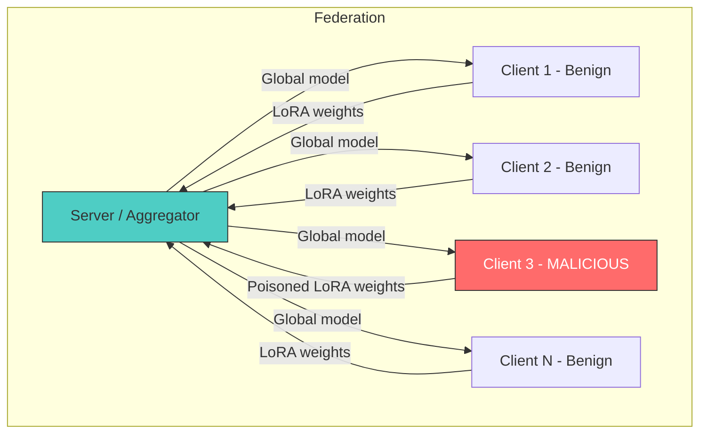

# Threat Model

## Overview

Our threat model defines precisely what the attacker can and cannot do. This is critical for a security paper — vague threat models make results meaningless.

## The Actors



## What the Attacker SEES

| Information | Access? | Notes |
|-------------|---------|-------|
| Own local training data | ✅ | Attacker controls their own data |
| Global model weights (each round) | ✅ | Server broadcasts to all clients |
| Own previous updates | ✅ | Attacker remembers their history |
| Other clients' raw data | ❌ | Fundamental FL privacy guarantee |
| Other clients' model updates | ❌ | Server doesn't share individual updates |
| Server aggregation logic | ❌ | Attacker doesn't know which defense is used |
| Number of other clients (N) | ⚠️ | May be inferred but not guaranteed |

## What the Attacker CONTROLS

1. **Own local training loop:** Optimizer, learning rate, number of epochs, loss function — everything about how they train.
2. **Own training data:** Can inject arbitrary poisoned examples into their shard.
3. **Which LoRA layer regions to attack:** Can choose early/middle/late adapters to maximize impact while minimizing detectability.
4. **Update magnitude and direction:** Can scale, project, or otherwise manipulate the update sent to the server.
5. **Multi-round consistency:** Can maintain a coherent attack strategy across rounds (PoisonedFL-style, Paper C3).

## What the Attacker WANTS (Goal)

**Targeted behavioral steering:** Bias the global model's framing on a specific narrow topic (e.g., climate change) toward a desired direction (e.g., denial/skepticism), while:
- Preserving general model capability (no perplexity degradation)
- Avoiding detection by Byzantine-robust aggregation
- Working even as N grows large (the scaling question)

This is NOT:
- Untargeted degradation (just making the model worse)
- Backdoor with a trigger (no special input pattern needed)
- Full model takeover (only affects one topic)

## What the Server Sees

The server (aggregator) receives a list of LoRA weight updates from all clients. It knows:
- The update vectors (parameters)
- How many examples each client trained on
- Potentially: norms, cosine similarities between updates (if running a defense)

The server does NOT know:
- Whether any particular update was generated honestly
- What data any client trained on
- Which layers a client chose to adapt (all clients report same-shape tensors; the "choice" is in which layers have non-trivial updates)

## Stealth Definition

An attack is **stealthy** if:
1. **Statistical stealth:** The malicious update's L2 norm, cosine similarity to median, and per-coordinate distribution are indistinguishable from benign updates (pass Krum, Trimmed Mean, Cosine Filter).
2. **Utility stealth:** The poisoned global model maintains baseline performance on general tasks (perplexity, MMLU accuracy within ε of clean model).
3. **Behavioral stealth:** The bias only manifests on the target topic — responses to unrelated prompts are unaffected.

## Formal Attacker Model

```
Given:
  - Federation of N clients, 1 malicious (fraction f = 1/N)
  - Global model M with L transformer layers
  - LoRA adapters of rank r on subset of layers
  - Aggregation strategy A ∈ {FedAvg, Krum, TrimmedMean, CosineFilter}
  - T communication rounds

Attacker chooses:
  - Layer region R ∈ {early, middle, late, full}
  - Poison ratio ρ (fraction of local data replaced)
  - Scaling strategy σ (how to amplify/constrain the update)
  - Consistency strategy (maintain direction across rounds)

Attacker's optimization (informal):
  maximize  ASR(M_poisoned, target_prompts)
  subject to:
    PPL(M_poisoned, general_corpus) ≈ PPL(M_clean, general_corpus)
    A.detect(attacker_update) = False
```

## Why This Threat Model Is Realistic

1. **Single attacker in large federation:** Any organization could go rogue. With N=64, one bad actor is plausible.
2. **No server compromise:** The server is trusted infrastructure (e.g., run by a consortium). Compromising it is a different, harder attack.
3. **No collusion:** Coordinating multiple malicious clients requires conspiracy. Single-attacker is the baseline threat.
4. **Layer region choice is novel:** No prior work (to our knowledge) explores how the attacker's choice of *which* LoRA layers to poison affects the attack/defense Pareto frontier.

## What's NOT In Scope

- **Defending against the attack:** We study the attack surface. Per-layer attestation is future work.
- **Adaptive defenses:** We test against fixed defenses, not defenses that adapt to the attacker.
- **Privacy attacks:** We don't try to extract other clients' data.
- **Backdoor triggers:** Our attack is always-on for the target topic, not triggered by a special input.
