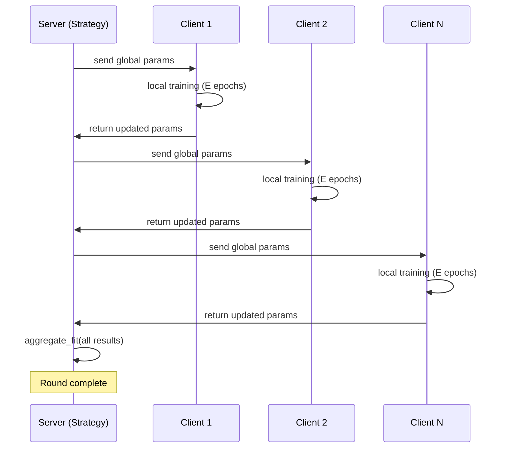

# Flower Architecture

## What Is Flower?

Flower (flwr) is an open-source federated learning framework. It provides:
- A simulation engine (runs N clients on one machine, time-sliced)
- Client/server abstractions
- Pluggable aggregation strategies
- Communication protocols (gRPC for distributed, in-process for simulation)

We use **Flower simulation mode** exclusively — all clients run on one GPU, one at a time.

## Simulation Engine: How Time-Slicing Works

In simulation mode, Flower does NOT run clients in parallel. It:

1. Creates a virtual pool of N clients
2. For each round, iterates over selected clients **sequentially**
3. For each client: instantiates it, calls `fit()`, collects the result, then **destroys** the client object
4. After all clients have fit, calls the strategy's `aggregate_fit()`
5. Repeats for the next round

**Memory implication:** Only ONE client exists at a time. The model is shared across all clients (they get/set parameters from the same model object). This means:
- Peak VRAM = 1 model + 1 batch of activations
- For Llama-3.2-1B in bf16: ~2 GB model + ~1–2 GB activations = ~4 GB peak
- A10G has 24 GB → plenty of headroom

## Core Abstractions

### NumPyClient

The simplest client interface. You implement three methods:

```python
class MyClient(fl.client.NumPyClient):
    def get_parameters(self, config) -> list[np.ndarray]:
        """Return model parameters as numpy arrays."""
        ...

    def fit(self, parameters, config) -> tuple[list[np.ndarray], int, dict]:
        """Train locally, return (updated_params, num_examples, metrics)."""
        ...

    def evaluate(self, parameters, config) -> tuple[float, int, dict]:
        """Evaluate on local data, return (loss, num_examples, metrics)."""
        ...
```

### Strategy

Server-side aggregation logic. Built-in strategies include FedAvg, FedProx, etc. We subclass to add Krum/TrimmedMean/CosineFilter:

```python
class MyStrategy(fl.server.strategy.FedAvg):
    def aggregate_fit(self, server_round, results, failures):
        """Custom aggregation logic."""
        # results is list of (ClientProxy, FitRes) tuples
        # FitRes.parameters contains the client's update
        ...
        return aggregated_parameters, metrics
```

### FL Round Lifecycle



## Minimal Runnable Snippet

This runs a 3-client, 2-round FL simulation with a tiny model:

```python
import flwr as fl
import numpy as np
from flwr.common import ndarrays_to_parameters

# Fake "model" — just a 1D array
global_weights = [np.zeros(10)]

class SimpleClient(fl.client.NumPyClient):
    def __init__(self, cid):
        self.cid = int(cid)

    def get_parameters(self, config):
        return global_weights

    def fit(self, parameters, config):
        # "Train": shift weights by client-specific amount
        updated = [p + 0.1 * (self.cid + 1) for p in parameters]
        return updated, 100, {"client": self.cid}

    def evaluate(self, parameters, config):
        loss = float(np.sum(parameters[0] ** 2))
        return loss, 100, {}

def client_fn(cid: str):
    return SimpleClient(cid).to_client()

# Run simulation
history = fl.simulation.start_simulation(
    client_fn=client_fn,
    num_clients=3,
    config=fl.server.ServerConfig(num_rounds=2),
    strategy=fl.server.strategy.FedAvg(
        fraction_fit=1.0,
        min_fit_clients=3,
        min_available_clients=3,
    ),
)
print(f"History: {history}")
```

## How Our Code Uses Flower

In `experiment.py`:

1. `client_fn(cid)` creates either a `BenignClient` or `MaliciousClient` based on `cid`
2. Each client wraps a shared `model` — they call `set_parameters()` to load global weights and `get_parameters()` to return updated LoRA weights
3. `get_strategy(defense_name)` returns our custom strategy (Krum, TrimmedMean, etc.)
4. `fl.simulation.start_simulation()` orchestrates everything

## Key Flower Simulation Details

- **`client_fn` is called fresh each round** — don't store state on the client object across rounds (use checkpoints instead)
- **`fraction_fit=1.0`** means all clients participate every round (no sampling)
- **Ray backend** (optional): Flower can use Ray for parallel client execution, but for sequential LoRA training on one GPU, the default is fine
- **Client resources:** In simulation, you can specify `client_resources={"num_gpus": 0.25}` to control concurrency. We use the default (sequential).

## Debugging Tips

- Set `FLWR_LOG_LEVEL=DEBUG` to see all communication
- The `history` object returned contains per-round losses and metrics
- For custom metrics aggregation, override `aggregate_evaluate()` in your strategy
- If you get OOM, reduce `batch_size` — only one client trains at a time, so memory should be predictable

## Flower Version Notes (≥1.13)

Flower 1.13+ uses a new simulation API. Key changes:
- `start_simulation()` replaces older `fl.simulation.start_simulation()` with slightly different args
- Clients must return `.to_client()` from the factory function
- Strategy `aggregate_fit` receives `list[tuple[ClientProxy, FitRes]]`
